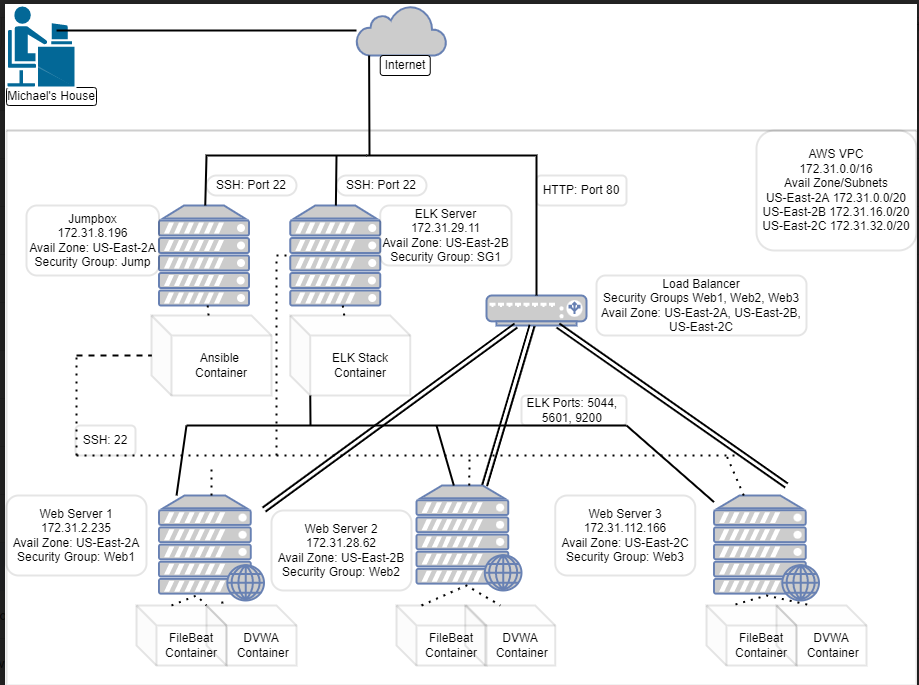

## Automated ELK Stack Deployment

The files in this repository were used to configure the network depicted below.

These files have been tested and used to generate a live ELK deployment on Amazon Web Services. They can be used to recreate the entire deployment pictured above. Alternatively, select portions of the configuration files may be used to install only certain pieces of it, such as Filebeat.

[Filebeat](Ansible/Filebeat.yml.txt)

This document contains the following details:
- Description of the Topology
- Access Policies
- ELK Configuration
  - Beats in Use
  - Machines Being Monitored
- How to Use the Ansible Build

### Description of the Topology

The main purpose of this network is to expose a load-balanced and monitored instance of DVWA, the D*mn Vulnerable Web Application.

Load balancing ensures that the application will be highly available, in addition to restricting traffic to the network.

Load Balancers protect against one server being overwhelmed with requests while maintaining one frontend website. A jump box functions to help scale the system up as needed by configuring new webservers.  It utilizes ssh keys to configure machines.

Integrating an ELK server allows users to easily monitor the vulnerable VMs for changes to the network and system logs.

Filebeat provides monitoring of log files and forwards them to the ELK server.

Metricbeat forwards system data such as cpu usage, network usage, and memory to the ELK stack.

The configuration details of each machine may be found below.

| Name       | Function  | IP Address     | OS    |
|------------|-----------|----------------|-------|
| Jumpbox    | Gateway   | 172.31.8.196   | Linux |
| ELK Server | Gateway   | 172.31.29.11   | Linux |
| Webserver1 | Webserver | 172.31.2.235   | Linux |
| Webserver2 | Webserver | 172.31.28.62   | Linux |
| Webserver3 | Webserver | 172.31.112.166 | Linux |

### Access Policies

The machines on the internal network are not exposed to the public Internet. 

Only the Jumpbox machine can accept connections from the Internet. Access to this machine is only allowed by SSH to computers with the pem key

Machines within the network can only be accessed by SSH to machines with the pem key.  

The ELK stack is accessible by TCP port 5601.

### Elk Configuration

Ansible was used to automate configuration of the ELK machine. No configuration was performed manually, which is advantageous because automation allows a machine to be quickly deployed and configured.

The playbook implements the following tasks:
*Installs files
*Installs Docker and Python
*Increases ELK server memory
*Launches the ELK Container 

### Target Machines & Beats
This ELK server is configured to monitor the following machines:
172.31.2.235
172.31.28.62
172.31.112.66

We have installed the following Beats on these machines:
Filebeat
Metricbeat

These Beats allow us to collect the following information from each machine:
We will be able to monitor system log information from Filebeat and CPU, Memory, Network, and Disk usage from Metricbeat.

### Using the Playbook
In order to use the playbook, you will need to have an Ansible control node already configured. Assuming you have such a control node provisioned: 

SSH into the control node and follow the steps below:
- Copy the configuration file to /etc/ansible/files.
- Update the /etc/ansible/hosts file to include the Web and ELK server IP.
Run the playbook, and navigate to ELK Stack Kibana to check that the installation worked as expected.

- Copy install-elk.yaml to /etc/ansible
- To make the playbook work on specific machines edit /etc/ansible/hosts to ensure the correct machine is commented out or needs to be uncommented._
- Filebeat is installed on the Webservers and the ELK server is its own separate machine.
- To check the machine is running go to http://172.31.29.11/app/kibana
